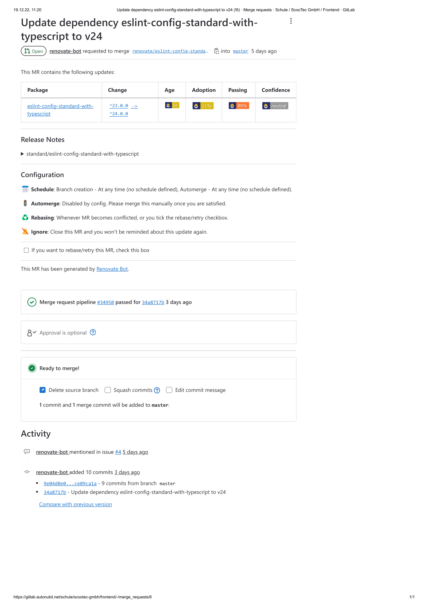
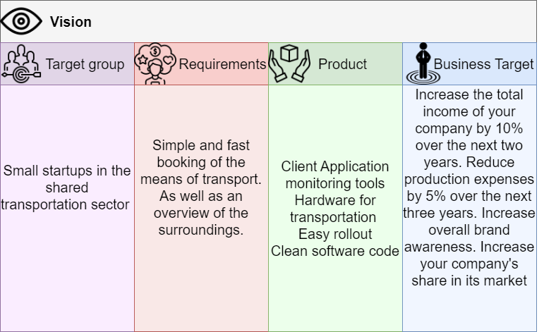

<br />
<div align="center">
  <a href="https://github.com/noahzmr/scooter-app">
    
  </a>

  <h3 align="center">Scooter App</h3>

  <p align="center">
    A school project!
    <br />
    <a href="https://github.com/noahzmr/scooter-app"><strong>Explore the docs »</strong></a>
    <br />
    <br />
    <a href="https://scooter.noerkelit.online/">View Live Demo</a>
    ·
    <a href="https://github.com/noahzmr/scooter-app/issues">Report Bug</a>
    ·
    <a href="https://github.com/noahzmr/scooter-app/issues">Request Feature</a>
  </p>
</div>

<details>
  <summary>Table of Contents</summary>
  <ol>
  <li>
    <a href="#about">About</a>
    <ul>
        <li><a href="#built-with">Built With</a>
        <li><a href="#coming-soon">Coming soon</a>
    </ul>
  </li>
    <li>
        <a href="#introduction">Introduction</a>
        <ul>
            <li><a href="#app">App</a></li>
            <li><a href="#scooter-hardeware">Scooter Hardeware</a></li>
            <li><a href="#team-and-roles">Team and Roles</a></li>
        </ul>
    </li>
    <li>
        <a href="#requirements">Requirements</a>
        <ul>
            <li><a href="#software">Software</a></li>
            <li>
                <a href="#scooter-hardware">Scooter Hardware</a>
                <ul>
                    <li><a href="##solution-description">Solution description</a></li>
                    <li>
                        <a href="#solution-details">Solution Details</a>
                        <ul>
                            <li><a href="#sensors-&-actuators">Sensors & Actuators</a></li>
                            <li><a href="#embedded-code">Embedded Code</a></li>
                            <li>
                                <a href="#network">Network</a>
                                <ul>
                                    <li><a href="#logical-network-topology">Logical Network Topology</a></li>
                                </ul>
                            </li>
                            <li><a href="#cloud-&-data-analytics">Cloud & Data Analytics</a></li>
                        </ul>
                    </li>
                </ul>
            </li>
        </ul>
    </li>
    <li>
        <a href="#devops">DevOps</a>
        <ul>
            <li><a href="#plan">Plan</a>
              <ul>
                <li><a href="#moscow-priorisierung">MoSCoW-Priorisierung</a>
                  <ul>
                    <li><a href="#must-have">Must-have</a></li>
                    <li><a href="#should-have">Should-have</a></li>
                    <li><a href="#could-have">Could-have</a></li>
                    <li><a href="#wont-have">Wont-have</a></li>
                  </ul>
                </li>
              </ul>
            </li>
            <li><a href="#create">Create</a></li>
            <li><a href="#verify">Verify</a></li>
            <li><a href="#package">Package</a></li>
            <li><a href="#release">Release</a></li>
            <li><a href="#configure">Configure</a></li>
            <li><a href="#monitor">Monitor</a>
              <ul>
                <li><a href="#sentry">Sentry</a></li>
                <li><a href="#prometheus">Prometheus</a></li>
                <li><a href="#grafana">Grafana</a></li>
              </ul>
            </li>
        </ul>
    </li>
    <li>
        <a href="#business-canvas">Business Canvas</a>
        <ul>
        <li><a href="#vision-board">Vision Board</a></li>
            <li>
                <a href="#key-partners">Key Partners</a>
                <ul>
                    <li><a href="#personas-from-the-scootec">Personas from the ScooTec</a></li>
                </ul>
            </li>
            <li><a href="#key-activities">Key Activities</a></li>
            <li><a href="#key-resources">Key Resources</a></li>
            <li><a href="#customer-relationships">Customer Relationships</a></li>
            <li><a href="#customer-segments">Customer Segments</a></li>
            <li><a href="#channels">Channels</a></li>
            <li><a href="#value-propositions">Value Propositions</a></li>
            <li>
                <a href="#cost-structure">Cost Structure</a>
                <ul>
                    <li><a href="#production">Production</a></li>
                    <li><a href="#logistik">Logistik</a></li>
                    <li><a href="#selling">Selling</a></li>
                </ul>
            </li>
        </ul>
    </li>
    <li>
        <a href="#features">Features</a>
        <ul>
            <li><a href='#current-version'>Current Version</a></li>
            <li><a href='#next-version'>Next Version</a></li>
            <li><a href="#structure-chart">Structure Chart</a></li>
            <li>
                <a href="#uml">UML</a>
                <ul>
                    <li><a href="#use-case">Use Case</a></li>
                    <li><a href="#sequence-diagram">Sequence Diagram</a></li>
                    <li><a href="#distribution-diagram">Distribution diagram</a></li>
                </ul>
            </li>
            <li>
                <a href="#flowdiagramm">Flowdiagramm</a>
                <ul>
                    <li><a href="#scootec-gmbh-website">ScooTec GmbH Website</a></li>
                    <li><a href="#sensor-device-with-the-website">Sensor Device with the Website</a></li>
                </ul>
            </li>
            <li><a href="#electric-circuit-diagram">Electric Circuit Diagram</a></li>
            <li><a href="#sql-model">SQL Model</a></li>
        </ul>
    </li>
    <li>
        <a href="#extra">Extra</a>
        <ul>
            <li><a href="#test">Test</a></li>
            <li>
                <a href="#insterllation">Insterllation</a>
                <ul>
                    <li><a href="#arduino-on-a-pi">Arduino on a Pi</a></li>
                    <li><a href="#gps-module">GPS Module</a></li>
                </ul>
            </li>
        </ul>
    </li>
    <li><a href="#contact">Contact</a></li>
    <li><a href="#hosted">Hosted</a></li>
    <li><a href="#support">Support</a></li>
    <li><a href="#demo">Demo</a></li>
  </ol>
</details>

## About

This is a school assignment that was created in three blocks, each of which was three weeks long, 
The scenario from the first block was to write a script that calculates the travel costs for a scooter rental.
It was up to us if we wanted to keep it a pure terminal application or if we wanted to add a UI to it.
In the next block, live data should be read out with the help of an Arduino and a Raspberry Pi, and a business plan should be created.
In the last block we should cover the topic of DevOps, where we use pipline, monitoring, testing and build processes.
For us it was possible to connect this with the first block where the sensor package represents a scooter.

### Built With
[](https://expressjs.com/de/)
[](https://reactjs.org)
[](https://mariadb.com/docs/)
[](https://www.npmjs.com/)
[](https://www.javascript.com/)
[](https://www.docker.com/)
[](https://ubuntu.com/download?gclid=Cj0KCQiA37KbBhDgARIsAIzce16YF-tHi0cfujV9iwI4m9iC1zlTmt7il2I-97BzOt8PvtOG8AlIApEaAuCaEALw_wcB)
[](https://developer.paypal.com/)
[](https://github.com/speakeasyjs/speakeasy)
[](https://nodemailer.com/about/)
[](https://leafletjs.com/)
[](https://www.raspberrypi.com/)
[](https://www.arduino.cc/)
[](https://serialport.io/)
[](https://about.gitlab.com/resources/scaled-ci-cd/?utm_medium=cpc&utm_source=google&utm_campaign=singleappci_emea_pr_rsa_nb_exact_&utm_content=scaled-ci-cd_digital_x-pr_english_&&utm_term=ci%20cd&_bt=626050032843&_bk=ci%20cd&_bm=b&_bn=g&_bg=103866327354&gclid=Cj0KCQiAkMGcBhCSARIsAIW6d0D1Y3nJO2wh0tH5-NYqUGQ0qftov1pSSJQwPA3Z7piJ8Yc8Ex1IKLkaAiMiEALw_wcB)

[](https://min.io/)
[](https://de.wikipedia.org/wiki/C%2B%2B)
[](https://prometheus.io/)
[](https://grafana.com/)
[](https://sentry.io/)
[](https://docs.renovatebot.com/)
[](https://purgecss.com/)
[](https://nodejs.org/en/)
[](https://www.sonarqube.org/)
[](https://reactrouter.com/en/main)
[](https://eslint.org/)
[](https://www.selenium.dev/)
[](https://jestjs.io/)
[](https://www.terraform.io/)

### Coming soon

[](https://stripe.com/)
[](https://www.vaultproject.io/)

## Introduction

### App
We have developed a web application for the immagine company "ScooTec GmbH".
This is intended for the end user UI
Every user can register on the web page as well.
After registration the customer will receive an email and 20.00 starting credit will be added to his account.
For better security, the registration is done with an Authenticator, which is secure.
After registration, the position on the map is displayed, as well as the scooters in the vicinity.
When you click on a scooter, you can see the battery level as well as the scooter ID.
After clicking on `Choose Scoter` the ride can be started.
When the ride is finished the timer resets to zero and it is calculated how much the ride cost, 0,89€ activation fee and 0,18€ per minute.
The outstanding amount is automatically deducted from the credits and the user receives a personalized email with the important information. 
Payment methods such as PayPal, MasterCard, Klarna, etc. can be integrated.
You can also add cards and save them.

### Scooter Hardeware

With the Scooters is often not as desired handled, whereby it comes to damage.
In general, the data transmission does not run as desired and needed.
Therefore, we need to develop a device that collects important data and sends it to a central location.
With an admin account should be logged on their site and to each scooter a dashboard can be retrieved.

### Team and Roles

| Function | Group or User |
| -------- | ------------- |
| Problem Owner | ScooTec GmbH |
| Developer | Noah Danyael Zeumer |
| Designer | Noah Danyael Zeumer, Ben Luca Eibel, Vincent Wolff | 
| Network Engineer | Noah Danyael Zeumer |
| Business Expert | Ben Luca Eibel |
| Time & Note Keeper | Vincent Wolff |

## Requirements

### Software

It is a ReactJS frontend with a Node Express backend.
To test the app you need:
- a MariaDB database
- NodeJS
- PayPal development account 
- An email account
- Microsoft Authenticator App / or similar

As well as a `.env` file in `backend` path that looks like this:

```
# DB
DB_HOST=0.0.0.0
DB_PORT3306
DB_USER=root
DB_PASSWORD=*************
DB_DATABASE=scooter-gmbh

# Mail
MAIL_USER=*******@****.**
MAIL_PASSWORD=*******
MAIL_HOST=imap.****.**
MAIL_PORT=***
MAIL_TLS=***
MAIL_SECURE=true
MAIL_SERVICE=*****
MAIL_NAME= <****@****.**>

# Minio
MINIO_ROOT_USER=****
MINIO_ROOT_PASSWORD=********

# Client
MINIO_CLIENT_ENDPOINT=*******
MINIO_CLIENT_USESSL=*****
MINIO_CLIENT_ACCESSKEY=****
MINIO_CLIENT_SECRETKEY=********

# PayPal
PAYPAL_CLIENTID=***************************

# Sentry
SENTRY_DNS=https://****************@sentry.********/**
```

For insterlation the git responsitory must be clonetted and installed with `npm install`.
With `npx express-generator` you can create an express application.

With `npx create-react-app PROJECT_NAME` you create a React App.


### Scooter Hardware

#### Solution description


ScooTec GmbH, to whom we have already sold a scooter app, complained about a lack of data analysis of the scooters. We fulfill their request by providing a scooter with a 
- temperature and humidity sensor, 
- GPS, 
- Gyroskop. 

This can show more accurate details about the scooters.

#### Solution details

##### Sensors & Actuators

-	Temp(0-55) and Humidity
-	Digital Temperature(-55 bis 125)
-	GPS Mouse 
-	GY-521(Gyroskop)

#### Embedded Code

| For | medocino | School |
| --- | -------- | ------ |
| UI/UX | [Gitlab Autonubil](https://gitlab.autonubil.net/schule/scootec-gmbh/frontend) | [Gitlab School](https://gitlab.com/itech_ble_nze/lf-seven-and-2/frontend) |
| Backend | [Gitlab Autonubil](https://gitlab.autonubil.net/schule/scootec-gmbh/backend) | [Gitlab School](https://gitlab.com/itech_ble_nze/lf-seven-and-2/backend) |
| Rasperry & Arduino | [Gitlab Autonubil](https://gitlab.autonubil.net/schule/scootec-gmbh/arduino) | [Gitlab School](https://gitlab.com/itech_ble_nze/lf-seven-and-2/scooter-hardware) |

#### Network

##### Logical Network Topology


#### Cloud & Data Analytics

With the help of the driving data, the areas can be adjusted.
Thanks to the user data, the target group analysis is easier and it is possible to target new groups.

Also the condition of the scooters can be seen faster, does a user drop the scooter or did it happen after the customer left.

The temperature can also show useful disadvantage for the customer, such as "It might be slippery, so please drive carefully." 
F

## DevOps

  <div>
    
    <map name="image-map">
      <area href='#plan' alt="Create" title="Create"
        coords="347,149,317,151,293,152,266,163,254,164,238,175,221,188,205,202,189,214,181,226,170,237,165,256,160,272,154,290,150,318,79,348,8,320,13,274,28,227,50,176,100,105,151,64,212,31,280,12,343,7,316,79,316,85,344,152,295,94,305,90"
        shape="poly">
      <area target="" alt="verify" title="verify" href="#verify"
        coords="7,337,79,364,145,339,153,389,179,443,213,489,267,518,316,530,346,600,317,670,258,665,203,644,159,621,104,576,67,534,34,474,13,414,7,370"
        shape="poly">
      <area target="" alt="package" title="package" href="#package"
        coords="334,531,395,522,449,494,480,467,505,434,520,396,528,364,601,335,670,361,659,435,644,474,620,515,596,549,565,584,497,631,441,655,373,670,333,671,361,603"
        shape="poly">
      <area target="" alt="realase" title="realase" href="#realase"
        coords="530,346,601,320,670,343,683,272,721,208,775,171,833,150,886,149,928,89,917,13,836,7,760,22,690,51,638,89,595,138,548,225,533,283,529,317"
        shape="poly">
      <area target="" alt="configure" title="configure" href=""
        coords="932,18,943,91,902,152,965,179,1005,211,1029,247,1047,293,1053,333,1051,364,1116,406,1189,400,1184,256,1143,169,1080,93,999,36"
        shape="poly">
      <area target="" alt="monitor" title="monitor" href="#monitor"
        coords="840,529,797,595,807,665,840,671,870,674,952,660,1036,625,1093,577,1145,513,1187,414,1113,424,1050,382,1010,468,940,522,883,530,869,534"
        shape="poly">
      <area target="" alt="plan1" title="plan1" href="#features"
        coords="669,366,665,402,660,427,652,457,635,492,600,548,660,608,693,627,750,653,785,662,777,595,814,530,744,493,699,442"
        shape="poly">
      <area target="" alt="plan2" title="plan2" href="#features"
        coords="361,151,332,79,363,7,438,23,501,49,552,85,596,132,568,175,551,208,544,226,538,254,526,309,510,249,466,195,411,158"
        shape="poly">
    </map>
  </div>

### Plan

The plan area can be divided into the following two areas.

<details>
  <summary>Technical</summary>
    <li>
        <a href="#features">Features</a>
        <ul>
            <li><a href='#current-version'>Current Version</a></li>
            <li><a href='#next-version'>Next Version</a></li>
            <li><a href="#structure-chart">Structure Chart</a></li>
            <li>
                <a href="#uml">UML</a>
                <ul>
                    <li><a href="#use-case">Use Case</a></li>
                    <li><a href="#sequence-diagram">Sequence Diagram</a></li>
                </ul>
            </li>
            <li>
                <a href="#flowdiagramm">Flowdiagramm</a>
                <ul>
                    <li><a href="#scootec-gmbh-website">ScooTec GmbH Website</a></li>
                    <li><a href="#sensor-device-with-the-website">Sensor Device with the Website</a></li>
                </ul>
            </li>
            <li><a href="#electric-circuit-diagram">Electric Circuit Diagram</a></li>
            <li><a href="#sql-model">SQL Model</a></li>
        </ul>
    </li>
</details>

<details>
<summary>Business Canvas</summary>
    <ul>
        <li>
            <a href="#key-partners">Key Partners</a>
            <ul>
                <li><a href="#personas-from-the-scootec">Personas from the ScooTec</a></li>
            </ul>
        </li>
        <li><a href="#key-activities">Key Activities</a></li>
        <li><a href="#key-resources">Key Resources</a></li>
        <li><a href="#customer-relationships">Customer Relationships</a></li>
        <li><a href="#customer-segments">Customer Segments</a></li>
        <li><a href="#channels">Channels</a></li>
        <li><a href="#value-propositions">Value Propositions</a></li>
        <li>
            <a href="#cost-structure">Cost Structure</a>
            <ul>
                <li><a href="#production">Production</a></li>
                <li><a href="#logistik">Logistik</a></li>
                <li><a href="#selling">Selling</a></li>
            </ul>
        </li>
    </ul>
</details>

#### MoSCoW-Priorisierung

##### Must-have

- [x] Custom user
  - [x]  Sign-Up
  - [x]  Sign-In
  - [x]  Store Passwort Safe in a Database
- [x] Rent a scooter
- [x] Calculate duration and cost from the ride
- [x] Server Monitoring
  - [x] Prometheus
  - [x] Grafana
- [x] Error Monitoring
  - [x] Sentry
- [x] Automate Docker Build
- [x] Automate Deployment
- [x] You have developed a product [vision](#vision-board) for your software.
- [x] You have defined stories/tasks for your software that are to be implemented
- [x] You collect data from at least one data source
- [x] The data is processed and interpreted
- [x] The data is stored in log files or a database
- [x] You have designed the program to be readable and understandable, especially by using meaningful names of variables and functions and meaningful comments
- [x] You have tested the program for the implemented requirements
- [x] You have created a class diagram or [distribution diagram](#distribution-diagram) of your software
- [x] You have implemented at least one automated test

##### Should-have

- [x] Slated and Hashed
- [x] Two-factor authentication
- [x] Store data in Local Web Storage
- [x] A world map that searches for the current position
  - [x] View live location on the map, with the profile picture
  - [x] View scooters on the map
- [x] Invoice in the app
- [x] Add credit with a PayPal account
- [x] Dependecy Check
  - [x] Renovate Bot
- [x] Mobile Client Version
- [x] Automate Rollout use Terraform
- [x] You capture data from more than one data source
- [x] The data is processed and linked in a meaningful way
- [x] The data is made available via a medium
- [x] You have structured your program well by meaningful modules / classes
- [x] The program is readable, understandable and easily extendable by:
  - [x] A good program structure,
  - [x] self-explanatory program code, meaningful names of variables and functions as well as meaningful comments
- [x] You have implemented at least three automated tests

##### Could-have

- [x] Automated and personalized emails
   - [x] By creating a Account
   - [x] New Billing arrives
- [ ] Add Stripe as a payment method
- [ ] Diffrent Providers with Keycloak
- [x] Check Code Qualtity
  - [x] SonarQube
  - [x] EsLint
- [ ] Secret Managment
  - [ ] Vault
- [x] Remove unused CSS for the build
  - [x] PurgeCss
- [x] You have applied basics of object-oriented programming.
- [x] Selected data is stored in a database or other useful storage medium
- [x] Data is delivered via heterogeneous media
- [x] You have implemented at least five automated tests

##### Wont-have

- No NPM Packaging 
  - Just using Docker

### Monitor

In our case, monitoring consists of four parts:
- [Sentry](#sentry)
- [Prometheus](#prometheus)
- [Grafana](#grafana)
- [SonarQube](#sonar)

All important information is monitored, such as:
- Error messages
- Server load
- Data from Scooter
- Quality of the software

#### Sentry

[Sentry](https://sentry.io/) is an error and performance monitoring tool.

#### Prometheus

[Prometheus](https://prometheus.io/) is an open-source systems monitoring and alerting toolkit originally built at SoundCloud.

#### Grafana

[Grafana](https://grafana.com/) is an open source interactive data-visualization platform, developed by Grafana Labs, which allows users to see their data via charts and graphs that are unified into one dashboard (or multiple dashboards!) for easier interpretation and understanding.

### Pipline

We currently use four pipelines, which cover the complete flow from quality testing to roll-out.
These would be: 
- [Renovate](#renovate)
- [Sonar](#sonar)
- [Docker Build](#docker-build) 
- [Rollout on a server](#rollout-on-a-server)

#### Renovate

Renovate checks for new software packages on each run, it creates an issue based on this. Renovate also checks if the newer version is compatible with the software and creates a merge request.




#### Sonar

SonarQube is a self-managed, automatic code review tool that systematically helps you deliver clean code
It automatically runs once a day, one pass, if successful a Docker image is built and published. The piepline can also be triggered manually.


| What? | Short description |
| ----- | ----------------- |
| Bugs  | A coding mistake that can lead to an error or unexpected behavior at runtime. |
| Vulnerability | A point in your code that's open to attack. | 
| Code Smell | A maintainability issue that makes your code confusing and difficult to maintain. |
| Security hotspots | A security hotspot highlights a security-sensitive piece of code that the developer needs to review. Upon review, you'll either find there is no threat or you need to apply a fix to secure the code. |
| New Code | Displays only things that were added during the last pass |
| Quality gates | Quality gates enforce a quality policy in your organization by answering one question: is my project ready for release? |


### Test

All testing is fully automated using Jest and Selenium. 

#### Sign-Up

* Create new user
* Welcome email

https://user-images.githubusercontent.com/65290559/208714385-6f6c569a-eb32-456d-b15e-050c45db2cf8.mp4


#### Sign-In

* Log in with the created user

https://user-images.githubusercontent.com/65290559/208714566-2b7dfffe-81ca-4d75-8981-2a0d5cddeb61.mp4

#### Add credits

* Log in with the created user
* Add credits via PayPal

https://user-images.githubusercontent.com/65290559/208715462-5777a59b-8d86-43c1-bdbf-af101c1a4ece.mp4

#### Rent a Scooter

* Log in with the created user
* Rent a Scooter

https://user-images.githubusercontent.com/65290559/208715630-d7d1673a-0fc9-43fa-8bbf-9252a10f76f2.mp4

#### Delete User

* Log in with the created user
* Delete the created user

https://user-images.githubusercontent.com/65290559/208715794-7105f4df-b143-4c44-bd12-3c942ff1f6f5.mp4

## Business Canvas

### Vision Board



### Key Partners

Our business partners are the Raspberry Pi Foundation, Arduino as well as Elegoo.
With the help of our partners we were able to create a prototype and thanks to the e-scooter manufacturer Xiaomi Mi we were able to test our prototype under real conditions.

#### Personas from the ScooTec


### Key Activities

It is primarily aimed at industrial customers. With the help of the product, the most diverse data of an e-scooter can be read out. 
How: 
- Humidity
- speed
- position
- Inclination
The whole thing can also be included in Betshende software. 

### Key Resources

The main components for our product comes from Elegoo, the sensors and the wiring is supplied by them. The microcontroller is supplied by Arduino. The one platinum computer is supplied by the Raspberry PI foundation.

### Customer Relationships

The product is aimed at an already known business partner. 
The ScooTec GmbH has asked us for a device to better evaluate the scooter data. Of course, this device could also be installed on other devices.

### Customer Segments 

Our target group consists mainly of e-scooter scooter startups .

### Channels

We would like to recruit our potential customers via modern forms of advertising, such as social media. 
Of course, we also introduce our product to existing business partners.

### Value Propositions

All the hardware can be minimized to an extremely small size, which allows it to be used for a wide variety of sharing services, such as scooters, bicycles, etc..

The JSON format also allows the sensors to be quickly integrated into existing systems.

For each customer we also offer a basic software package with:
- Login
- OTP
- Payment
- Email notifications
- Data analysis

Our team is constantly working on adding new features and enhancing existing ones. 

### Cost Structure

The storage costs are currently still extremely low, it can be integrated with an office purely whereby no separate warehouse is needed.
It takes very little time to produce a device, usually 5 minutes for the hardware.
Thanks to Terraform we are able to roll out the software on several devices at the same time and customize it for individual customers.
In total it takes about 15 minutes until devices are ready for use. 
We expect a wear and tear of about 5 devices per month.
And the wage is 25€ per hour
In addition, there is the development department, which tries new innovative ideas.
The team currently consists of 3 people.
Our advertising costs per month are about 1.000 €.
The working hours consists of a 35 hour week. 

#### Production
 
| Cost Point per Device | Brutto Cost |
| --------------------- | ----------- |
| DHT11 Sensor | 0.16 € |
| GY-521 | 0.22 € |
| Custemize Arduino | 3.70 € |
| Custimze Raspberry Pi | 80.39 € |
| Total | 84,47 € |

| Cost Point | Brutto Cost |
| ---------- | ----------- |
| Office-Rent | 2.800 € per Month |
| Worker-Cost | 10.500 € per Month |
| Wear | 423,50 € per Month |
| Advertising costs | 1.000 € per Month |
| <strong>Total Cost</strong>|
| Cost Total | 14.723,50 € per Month |
| <strong> Cost Per Device </strong> |
| Cost per Hour | 105.17 € |
| 12 Devices per Hour | 1.013,64 € |
| Total | 1.118,81 € |
| <strong> Finall Cost </strong> |
| Device Cost | 93,23 € |
| 7% Win | 6,53 |

#### Selling 


| Cost Point | Brutto Cost |
| ---------- | ------

https://user-images.githubusercontent.com/65290559/208714689-167eed05-2e84-4bb2-895d-b4d0b22d402f.mp4

----- | 
| Software Rent | 30 € per Month |
| Software Hosting | 50 € for 100 devices |
| Support | 100 € per Hour |
| Complettly Outsource | from 9000 € per Month  |
| Sensor Paket | 100 € per Sensor |
| Cost per Device | 99,75 € |

### Revenue Streams

The project was financed by individual sponsors plus the company's own capital. In the future it will be financed by the above offer list.

## Features

### Current Version

- [x] Custom SignIn/SignUp
    - [x] With OTP
        - [x] A 2 factor token is automatically generated, the user has to scan this token at the first login, as well as enter the token.
    - [x] Password is sallted and hashed and stored in the database.
- [x] Log in with a specific user.
- [x] Store data in Local Web Storage 
- [x] Automated and personalized emails 
    - [x] By creating a Account
    - [x] New Billing arrives
- [x] A world map that searches for the current position
    - [x] View live location on the map, with the profile picture
    - [x] View scooters on the map
<!-- - [x] Add and save payment methods. -->
- [x] Rent a scooter
- [x] Calculate duration and cost from the ride
- [x] Invoice in the app, as well as in by email
- [x] Add credit, e.g. with a PayPal account

### Next Version

The next version should fix bugs and add the following features:

- [ ] Revise UI/UX
  - [ ] Mobile View Fixes
- [ ] Diffrent Providers with Keycloak
  - [ ] 
  - [ ] 
  - [ ] 

### Structure chart

Meaning of the colors:
- Blue = Frontend
- Green = Backend

#### Registrierung


#### Anmeldung an der Seite


#### Kosten Berechnen


#### Karten Input


#### PayPal


### UML

#### Use Case


#### Sequence Diagram


#### Distribution diagram


### Flowdiagramm

#### ScooTec GmbH Website


#### Sensor Device with the Website


### Electric Circuit Diagram


### SQL Model


## Extra

### Test

| Test case number | Test case description | Input values | Expected behavior | Observed behavior | Successful? |
|----------------------|----------------------------|-------------|----------------------|------------------------|--------------|
| 1 | reason algorithm, without user input (time*price per min) + entry fee | 5 | result becomes 1.84 | true |
| 10 | the user can start a stopwatch and the time will be given in mil sec | 5 | result will be 1,84 | result will be 54000,84. Mil sec were not converted | false |
| 20 | the user can start a stopwatch and the time will be given in mil sec and converted to min | 5 | result will be 1,84 | result will be NaN.the timer value will be given too late | wrong |
| 30 | With input (time*price per min) + start fee | 5 | Result becomes 1,84 | True |

### Insterllation

### Installation
The both insterllation was tested with Ubuntu 20.04LTS, Docker version 20.10.17 and docker-compose version 1.25.0.
First, this Git repo must be cloned, with the following command:
```
git clone https://github.com/noahzmr/scooter-app.git
```

### Local

- [ ] Set up [UI Directorie](#ui-directorie)
  - [ ] Clone project in the Path
  - [ ] Install node modules
- [ ] Set up [Backend](#backend-directorie)
  - [ ] Clone project in the Path
  - [ ] Install node modules
- [ ] [MariaDB](#mariadb)
  - [ ] Upload [Script](https://github.com/noahzmr/scooter-app/blob/master/sql/scooter-gmbh.sql)
- [ ] Edit the [env](#.env) file / if necessary
  - [ ] DB_HOST
  - [ ] DB_PORT
  - [ ] DB_USER
  - [ ] DB_PASSWORD
  - [ ] DB_NAME
  - [ ] MINIO_ROOT_USER
  - [ ] MINIO_ROOT_PASSWORD
  - [ ] MAIL_USER
  - [ ] MAIL_PASSWORD
  - [ ] MAIL_HOST
  - [ ] MAIL_PORT
  - [ ] MAIL_TLS
  - [ ] MAIL_SECURE
  - [ ] MAIL_SERVICE
  - [ ] MAIL_NAME
- [ ] Set Up min.io


#### UI Directorie

```
cd scooter_app
npm install
```

After the installation you can check with the command `npm start` if everything worked. If the following window appears at https://localhost:3000 every thing was success!


#### Backend Directorie

```
cd -
cd backend
npm install
cd -
```

#### MariaDB

Install MariaDB at this <a href='https://www.digitalocean.com/community/tutorials/how-to-install-mariadb-on-ubuntu-20-04'>tutorial</a>

Update Packages

```
sudo apt update
```

Install MariaDB

```
sudo apt install mariadb-server
```

Start MariaDB

```
sudo systemctl start mariadb.service
```

Run the security script

If the error appears:

```
ERROR 2002 (HY000): Can't connect to local MySQL server through socket '/var/run/mysqld/mysqld.sock' (2)
```

try:

```
sudo /etc/init.d/mysql stop
sudo /etc/init.d/mysql start
```

```
sudo mysql_secure_installation
```

Output:

```
NOTE: RUNNING ALL PARTS OF THIS SCRIPT IS RECOMMENDED FOR ALL MariaDB
      SERVERS IN PRODUCTION USE!  PLEASE READ EACH STEP CAREFULLY!

In order to log into MariaDB to secure it, we'll need the current
password for the root user.  If you've just installed MariaDB, and
you haven't set the root password yet, the password will be blank,
so you should just press enter here.

Enter current password for root (enter for none): 
OK, successfully used password, moving on...

Setting the root password ensures that nobody can log into the MariaDB
root user without the proper authorisation.

Set root password? [Y/n] y
New password: 
Re-enter new password: 
Password updated successfully!
Reloading privilege tables..
 ... Success!


By default, a MariaDB installation has an anonymous user, allowing anyone
to log into MariaDB without having to have a user account created for
them.  This is intended only for testing, and to make the installation
go a bit smoother.  You should remove them before moving into a
production environment.

Remove anonymous users? [Y/n] n
 ... Success!

Normally, root should only be allowed to connect from 'localhost'.  This
ensures that someone cannot guess at the root password from the network.

Disallow root login remotely? [Y/n] n
 ... skipping.

By default, MariaDB comes with a database named 'test' that anyone can
access.  This is also intended only for testing, and should be removed
before moving into a production environment.

Remove test database and access to it? [Y/n] n
 ... skipping.

Reloading the privilege tables will ensure that all changes made so far
will take effect immediately.

Reload privilege tables now? [Y/n] y
 ... Success!

Cleaning up...

All done!  If you've completed all of the above steps, your MariaDB
installation should now be secure.

Thanks for using MariaDB!
```

Import the Database

```
sudo mysql -u root -p
```

```
CREATE DATABASE scooter-gmbh;
```
from the path `~/scooter_app`:
```
sudo mysql -u root -p scooter-gmbh < ./sql/scooter-gmbh.sql
```

To check if everything works enter: 

```
sudo mysqlshow scooter-gmbh
```

Output: 
```
Database: scooter-gmbh
+----------------------+
|       Tables         |
+----------------------+
| billing              |
| credit               |
| login                |
| otp                  |
| ride                 |
| role                 |
| scooter              |       
| scooter_data_gy521   |  
| scooter_data_tem_hum |
| scoter_data          |  
| user                 |
+----------------------+
```

Now u can start the Backend by typing 

```
cd backend && npm start
```

Maybe this appears:

```
> backend@0.0.0 start
> node ./app.js

Initializing Database...
Connetion Failed! SqlError: (conn=72, no: 1698, SQLState: 28000) Access denied for user 'root'@'localhost'
```

then:

```
sudo mysql -u root -p
GRANT ALL PRIVILEGES ON *.* TO 'root'@'localhost' IDENTIFIED BY 'root';
```

After entering `npm start` again, you should see somthing at https://localhost:9001/index.


### Docker

To install the app with Docker, just run the `docker-compose.yaml` file by going to the project directory and running the following commands:

```
cd scooter_app
mkdir backend
cd backend
vi .env
```
The `.env` file lock the same as the as [here](#env)

After you setup the env file u you can run:

```
docker-compose up -d
```

At the first insterllation daurter the whole thing a little longer, because he downloaded the packets.

output:

```
Starting scooter_gmbh_db_1 ... done
Starting scooter_gmbh_minio_1   ... done
Starting scooter_gmbh_adminer_1 ... done
Starting scooter_gmbh_fullstack_1 ... done
```
When everything is ready, the UI should be available at https://localhost:3000.


### Arduino on a Pi

You can install Arduino on the Raspberry Pi with `sudo apt-get install arduino`.

### GPS Module 

Plug the device to the Raspberry PI.
With `ls /dev/tty*` you cann see a list with devices.
By runing `sudo cat /dev/ttyACM0` you will see the data from the USB GPS device.
After this you have to install the *gpsd* module with `sudo apt install gpsd`
To auto start the USB Device, after a boot go into `vi` or `nano` `/etc/default/gpsd`.
To check if everything runs wright install `sudo apt install gpsd-clients`.
Then type *xgps*.

`cgps`

## Contact

[](https://www.xing.com/profile/NoahDanyael_Zeumer/)
[](mailto:noah@noerkelit.online)


## Hosted

<div style='display: flex; flex-direction: row; justify-content: space-around; width: 200px;'>
<a href='https://medocino.net/' target="_blank"></a>

<a href='https://medocino.net/' target="_blank"></a>
</div>

## Support

If you like this project and it helped you I would appreciate a little support!

<a href='https://www.buymeacoffee.com/noahdnylzmr' target="_blank"></a>

## Demo

The demo version is available to all free.
All passwords are hashed and salted, so they are not visible in the database, but we recommend not to use passwords that you use somewhere.
The server is automatically restarted in the evening and all data is deleted.
